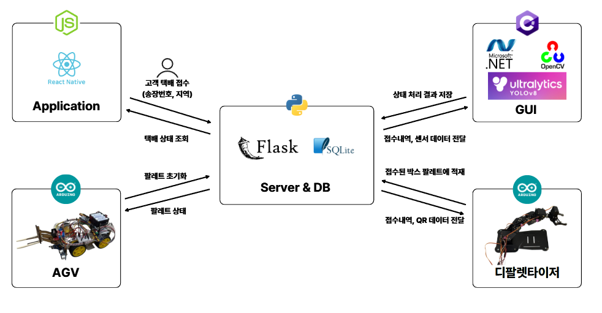
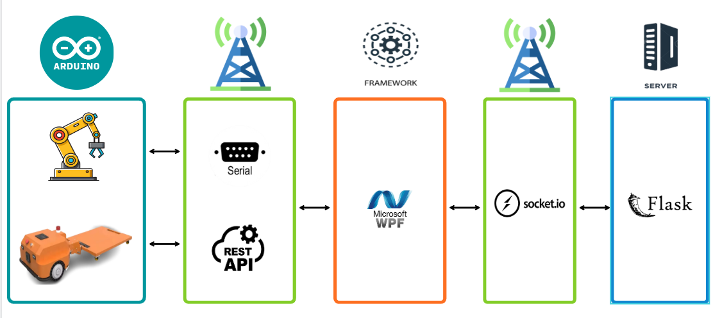
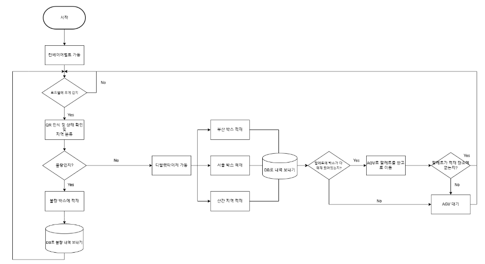
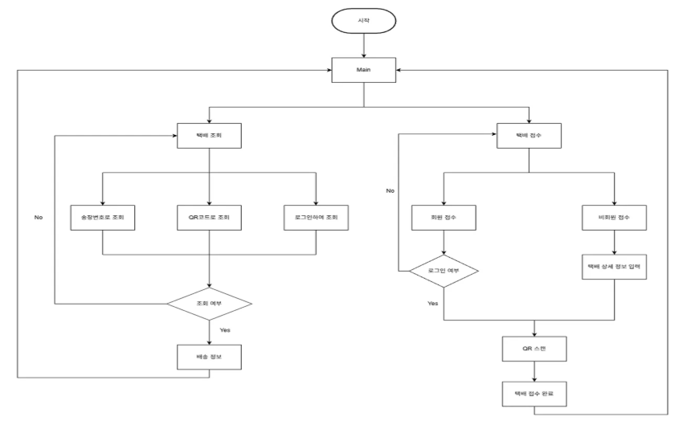
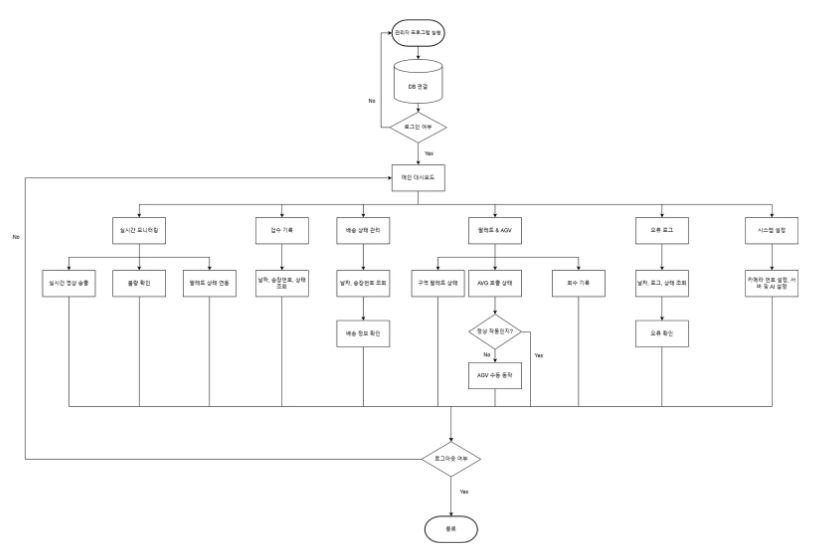
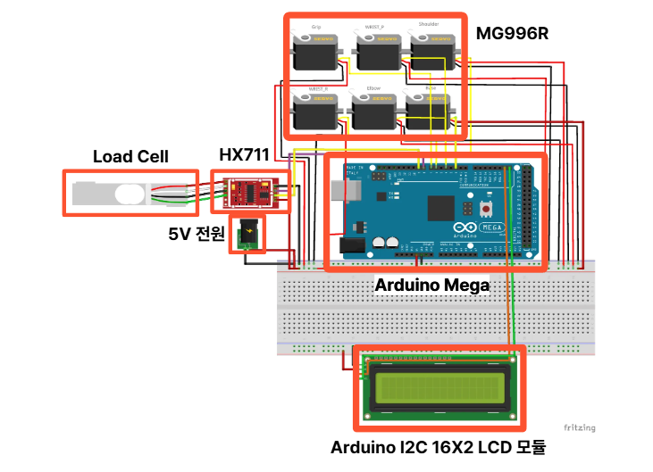
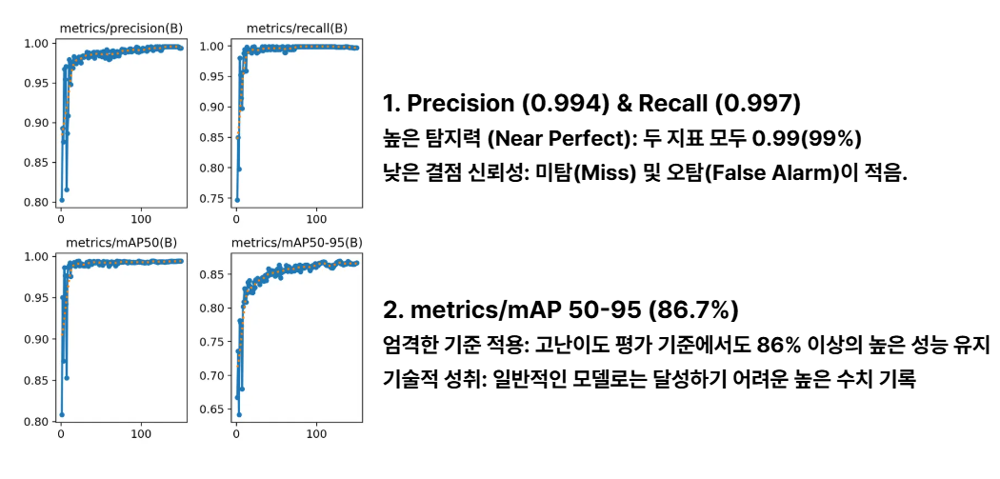
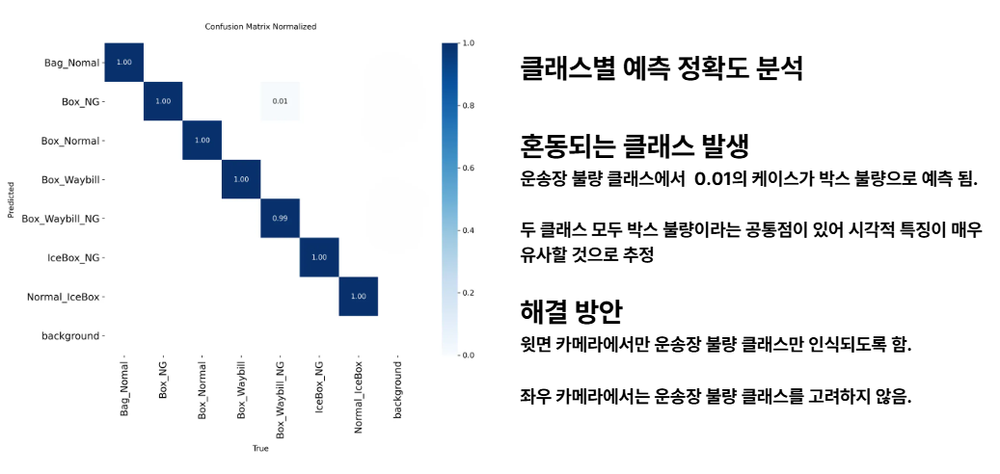

# 영상처리 및 인공신경망 기반 스마트 디팔렛타이저

## Smart Depalletizing System based on AI Vision & Neural Networks

# 프로젝트 개요 (Overview)

 개발 배경

팬데믹 이후 비대면 구매 증가로 물류 산업의 빠른 처리 속도, 정확한 분류, 자동화가 핵심 경쟁력이 되었습니다. 기존 인력 중심의 하역 작업은 작업자 피로 누적, 오분류, 안전사고 등의 문제가 지속적으로 발생하고 있습니다.

개발 목표

본 프로젝트는 인공신경망(AI) 기반 디팔렛타이저 시스템을 개발하여 이러한 문제를 해결합니다.
**[컨베이어 – 로봇 암 – 비전 – AI]**가 통합된 자동화 구조를 통해 물류 작업의 효율성, 정확성, 안전성을 향상시킵니다.

 개발 기간

2025.11.08 ~ 2025.12.12

핵심 기능 (Key Features)

기능

상세 내용

1. 시스템 아키텍쳐
> 

2. 통신 구조
> 

자동 감지 & 캡처

• 로드셀이 택배 무게 감지 시 자동 무게 측정

• 상·좌·우 카메라가 동기화되어 박스 이미지 캡처 시작

AI 비전 분석

• QR 코드 인식: 상단 카메라를 통해 운송장 정보 획득

• 결함 판별: 좌·우 카메라와 YOLO 모델을 이용해 박스 파손 여부 판별

데이터 통합 저장

• 무게, 이미지, AI 판별 결과(정상/불량)를 DB(SQLite)에 자동 기록

자동 적재 제어

• AI 분석 결과를 바탕으로 디팔렛타이저(로봇암)가 팔레트 위치에 따라 자동 분류 적재

실시간 모니터링

• Flask ↔ C# WPF (Socket.IO) 통신

• 작업 상태, 분류 현황, 기기 상태 실시간 시각화

# 기술 스택 (Tech Stack)

🔹 Environment & Tools

IDE: Visual Studio, Visual Studio Code

Collaboration: GitHub

Dataset: Roboflow

🔹 AI & Vision

Language: Python

Model: YOLO (Object Detection)

Libraries: OpenCV, PyTorch

🔹 Application & Control

Frontend: C# (WPF)

Hardware: Arduino (Sensor & Motor Control)

🔹 Backend & Data

Server: Flask (Python)

Communication: Socket.IO (Real-time)

Database: SQLite

# 시스템 흐름도 (System Architecture)

아래 영역에 실제 이미지 파일을 업로드해주세요.

1. 하드웨어 구성도 (Hardware Flow)
> 

2. 전체 애플리케이션 흐름도 (Application Flow)
> 
3. WPF 모니터링 시스템 구조 (WPF Flow)
> 
4. 개발 일정 (Gantt Chart)

# 하드웨어 (System H/W)

1. 디팔렛타이저
> 

2. AGV
> 

# YOLO학습결과

1. mAP50-90
> 

2. 전체 결과
> 

# 기대 효과 (Expected Effect)

작업 속도 극대화: 자동화된 분류 및 적재 프로세스 도입

분류 정밀화: AI 비전 검사를 통한 휴먼 에러 감소 및 오분류 방지

작업 안전화: 고중량 반복 작업의 자동화로 작업자 안전 확보

📬 Contact
