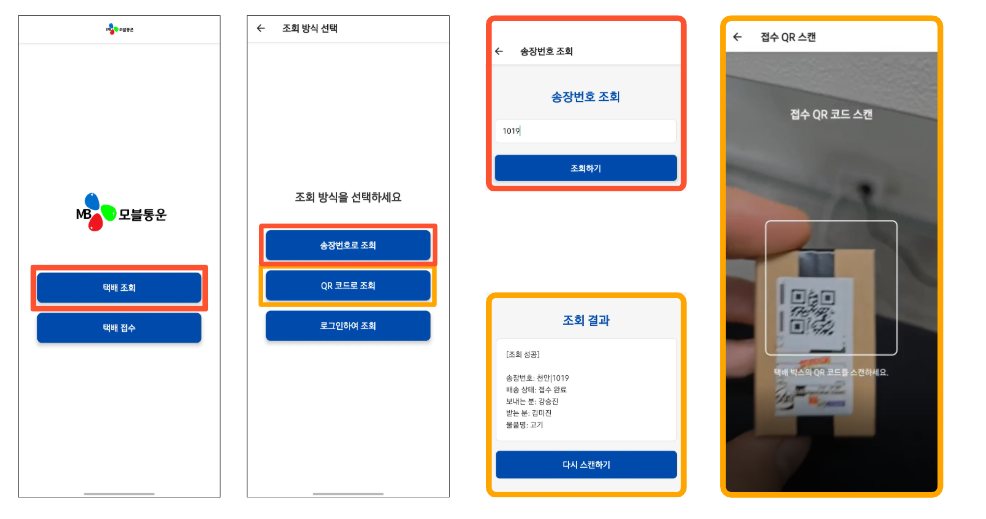
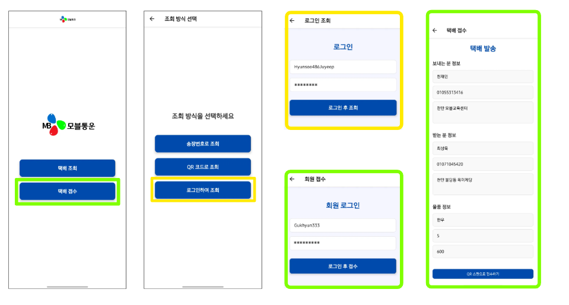
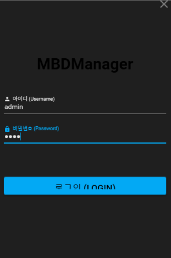
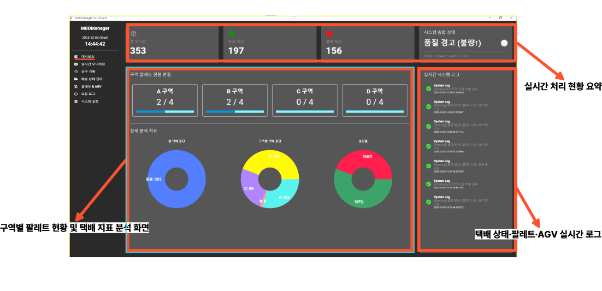
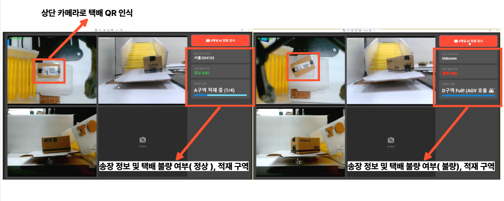
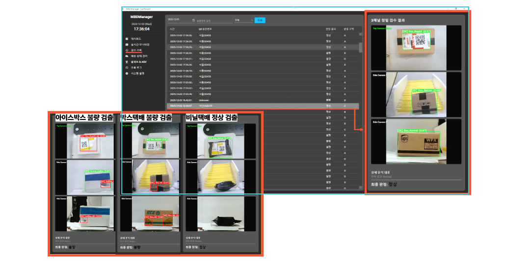
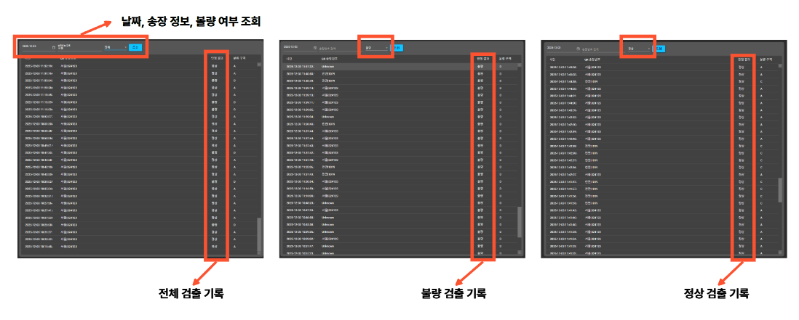
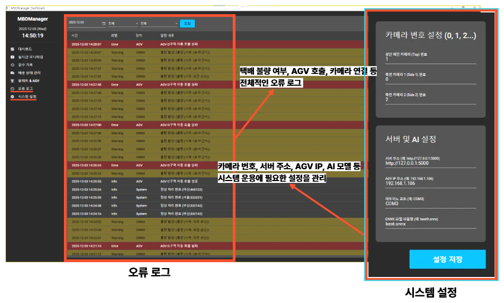

# 📦 영상처리 및 인공신경망 기반 스마트 디팔렛타이저
### Smart Depalletizing System based on AI Vision & Neural Networks

 

## 📋 프로젝트 개요 (Overview)

### 📅 개발 기간
**2025.11.08 ~ 2025.12.12**

### 🚩 개발 배경
팬데믹 이후 비대면 구매 증가로 물류 산업에서는 빠른 처리 속도와 정확한 분류, 그리고 자동화가 핵심 경쟁력이 되었습니다. 그러나 기존의 인력 중심 하역 작업은 작업자의 피로 누적, 오분류, 안전사고 등의 문제가 지속적으로 발생하고 있습니다.

### 🎯 개발 목표
본 프로젝트는 **[컨베이어 – 로봇 암 – 비전 – AI]**가 통합된 **인공신경망(AI) 기반 스마트 디팔렛타이저 시스템**을 개발하여, 물류 작업의 효율성, 정확성, 안전성을 혁신적으로 향상시키는 것을 목표로 합니다.

 

## 🛠 기술 스택 (Tech Stack)

| 분류 | 상세 기술 |
| :--- | :--- |
| **Environment** | Visual Studio, VS Code, GitHub, Roboflow |
| **AI & Vision** | **Language:** Python   **Model:** YOLO (Object Detection)   **Lib:** OpenCV, PyTorch |
| **Frontend & Control** | **App:** C# (WPF)   **H/W:** Arduino (Sensor & Motor Control) |
| **Backend & Data** | **Server:** Flask   **Protocol:** Socket.IO (Real-time)   **DB:** SQLite |

 

## 💡 핵심 기능 (Key Features)

| 기능 | 상세 내용 |
| :--- | :--- |
| **자동 감지 & 캡처** | • 로드셀을 통한 택배 무게 자동 측정   • 상·좌·우 카메라 동기화 및 박스 이미지 캡처 |
| **AI 비전 분석** | • **QR 코드 인식:** 상단 카메라로 운송장 정보 획득   • **결함 판별:** 좌·우 카메라와 YOLO 모델로 파손 여부 판별 |
| **데이터 통합 저장** | • 무게, 이미지, AI 판별 결과(정상/불량)를 SQLite DB에 자동 기록 |
| **자동 적재 제어** | • AI 분석 결과에 따라 로봇암이 팔레트 위치에 자동 분류 적재 |
| **실시간 모니터링** | • **Flask ↔ C# WPF (Socket.IO)** 양방향 통신   • 작업 상태, 분류 현황, 기기 상태 실시간 시각화 |

 

## 📐 시스템 아키텍쳐 (System Architecture)

### 1. 시스템 구조 및 통신

<b>📷 아키텍쳐 및 통신 구조 (클릭하여 펼치기)</b>

| 시스템 아키텍쳐 | 통신 구조 |
| :---: | :---: |
|  |  |

### 2. 흐름도 (Flowchart)

<b>📷 H/W 및 S/W 흐름도 (클릭하여 펼치기)</b>

| 하드웨어 흐름도 | 애플리케이션 흐름도 |
| :---: | :---: |
|  |  |

**WPF 모니터링 시스템 구조**

 

## 🤖 하드웨어 구성 (Hardware)

| 디팔렛타이저 시스템 | AGV (무인 운반차) |
| :---: | :---: |
|  |  |

 

## 📊 AI 학습 결과 (YOLO Performance)

| mAP 50-90 그래프 | 전체 검수 결과 |
| :---: | :---: |
|  |  |

 

## 🖥️ 소프트웨어 화면 (Screenshots)

### 📱 모바일 어플리케이션
| 택배 접수 | 택배 조회 |
| :---: | :---: |
|  |  |

### 💻 WPF 모니터링 프로그램
| 로그인 | 대시보드 |
| :---: | :---: |
|  |  |
| **검수 결과창** | **다양한 불량 사례** |
|  |  |
| **불량 조회** | **오류 로그** |
|  |  |

 

## ✨ 기대 효과 (Expected Effect)

1. **작업 속도 극대화** 🚀
   - 자동화된 분류 및 적재 프로세스 도입으로 처리량 증대
2. **분류 정밀화** 🎯
   - AI 비전 검사를 통한 휴먼 에러 제로화 및 오분류 방지
3. **작업 안전화** 🛡️
   - 고중량 반복 작업의 무인화로 작업자 안전 사고 예방

 

## 🎥 시연 영상 (Demo Video)

아래 이미지를 클릭하면 프로젝트 시연 영상을 **YouTube**에서 확인할 수 있습니다.

